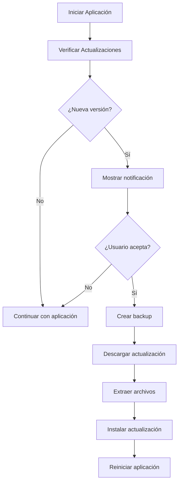

# Sistema de Actualización Automática

## 🔄 Autoforms - Auto-Update System

Este sistema permite que la aplicación **Autoforms** se actualice automáticamente desde las releases de GitHub sin intervención manual.

## ✨ Características

- ✅ **Verificación automática** al iniciar la aplicación
- ✅ **Comparación inteligente de versiones** usando semantic versioning
- ✅ **Descarga segura** desde GitHub Releases
- ✅ **Backup automático** antes de actualizar
- ✅ **Instalación automática** con preservación de configuración
- ✅ **Reinicio automático** después de la actualización

## 🚀 Cómo Funciona

### 1. Verificación al Inicio
```python
# Al iniciar la aplicación, se verifica automáticamente
🔍 Verificando actualizaciones...
INFO: Verificando actualizaciones para versión actual: 0.0.0
INFO: Última versión disponible: 1.2.0
INFO: Nueva versión encontrada: 1.2.0
```

### 2. Interacción con el Usuario
```bash
🆕 Nueva versión disponible: 1.2.0
📝 Cambios: Mejoras en el sistema de reportes

¿Desea actualizar ahora? (s/n): s
```

### 3. Proceso de Actualización
```bash
🔄 Iniciando actualización...
💾 Descargando actualización desde: https://github.com/GerzaFM/Autosol2/releases/...
Descargando: 45.2%
✅ Actualización completada. Reiniciando aplicación...
```

## 🛠️ Configuración

### Variables de Entorno
El sistema utiliza la configuración existente en `config/settings.py`:

```python
# Versión actual de la aplicación
version: str = "0.0.0"

# Repositorio de GitHub (configurado automáticamente)
github_repo = "GerzaFM/Autosol2"
```

### Archivos Preservados
Durante la actualización, estos archivos **NO** se sobrescriben:

- `.env` - Variables de entorno
- `config.ini` - Configuración local
- `facturas.db` - Base de datos SQLite
- `logs/` - Archivos de registro
- `database/backups/` - Respaldos de base de datos
- `.venv/` - Entorno virtual de Python

## 🔧 Uso Manual

### Verificar Actualizaciones
```bash
python -c "from src.utils.auto_updater import check_and_update; check_and_update()"
```

### Probar Sistema de Actualización
```bash
python test_updater.py
```

### Crear Nueva Release
```bash
# Ver información de la release
python create_release.py

# Confirmar y crear release
python create_release.py --confirm
```

## 📋 Requisitos

### Dependencias Python
```bash
pip install requests>=2.32.0 packaging>=24.1
```

### Permisos de GitHub
- El repositorio debe tener **releases públicas**
- Las releases deben seguir el formato `vX.Y.Z` (ejemplo: `v1.2.0`)
- Los assets deben incluir un archivo ZIP con el código fuente

## 🔒 Seguridad

### Verificaciones Implementadas
- ✅ **HTTPS obligatorio** - Solo descargas desde GitHub con SSL
- ✅ **Validación de versiones** - Comparación semántica estricta
- ✅ **Backup automático** - Respaldo completo antes de actualizar
- ✅ **Rollback manual** - Carpeta de backup para restauración
- ✅ **Timeout de conexión** - Evita bloqueos por conexión lenta

### Limitaciones
- ⚠️ **Sin verificación de firma digital** (futuro enhancement)
- ⚠️ **Solo GitHub Releases** (no soporta otros proveedores)

## 🎯 Flujo de Actualización



## 📝 Ejemplo de Release

### Estructura requerida en GitHub:
```
Release: v1.2.0
├── 📝 Título: "Autoforms v1.2.0 - Mejoras en reportes"
├── 📄 Descripción: "- Nueva funcionalidad X\n- Corrección bug Y"
└── 📎 Assets:
    └── Source code (zip) - Generado automáticamente por GitHub
```

## 🚨 Solución de Problemas

### Error 404 - Repository not found
```bash
WARNING: Error al verificar actualizaciones: 404 Client Error
```
**Solución**: Crear la primera release en GitHub o verificar que el repositorio sea público.

### Error de permisos
```bash
ERROR: No se pudo crear backup en: C:\Autoforms_backup_...
```
**Solución**: Ejecutar como administrador o cambiar permisos de carpeta.

### Error de conexión
```bash
WARNING: Error al verificar actualizaciones: ConnectTimeout
```
**Solución**: Verificar conexión a internet o firewall.

## 📈 Versiones

| Versión | Fecha | Cambios |
|---------|-------|---------|
| 0.0.0   | 2025-09-11 | Sistema de actualización implementado |

## 🤝 Contribuir

Para agregar mejoras al sistema de actualización:

1. Editar `src/utils/auto_updater.py`
2. Actualizar tests en `test_updater.py`
3. Documentar cambios en este README
4. Crear nueva release con `create_release.py`

---

**🔧 Desarrollado para Autoforms - Sistema de Gestión TCM Matehuala**